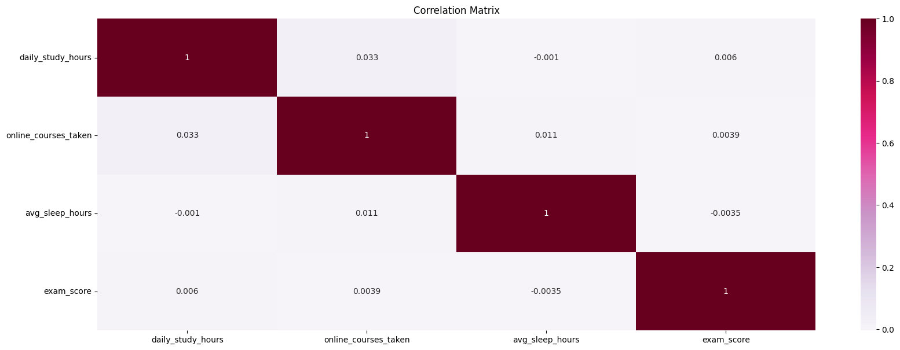

# Student Performance Analysis

Exploratory data analysis of 1_000 students
examining the relationship between study habits,
sleep patterns, online courses enrollment and
academic performance.

| | |
|---|---|
| Source | `https://www.kaggle.com/datasets/alhamdulliah123/student-learning-habits-and-exam-performance` |
| Size | 1,000 rows × 5 columns |
| Features | `daily_study_hours`, `online_courses_taken`, `avg_sleep_hours` |
| Target | `exam_score` range(40-100)|

---

<h1 align="center">Main Conclussion / Insights</h1>

The dataset appears to be synthetically generated. Exam scores are
statistically independent of the measured features. A real-world
dataset would likely show at least moderate correlations between
study time and academic performance.

**Limitations:**
- Dataset is likely synthetic - findings may not generalize
- Sample size of 1000 is adequate but larger samples would
reduce uncertainty in group comparisons

<h1 align="center">Executive Summary</h1>

| Variable | Details |
|---|---|
| **daily_study_hours**| Uniform distribution - KDE is almost flat, no distinct peak. Skewness ≈ 0 - symmetrical. Range: 0.5 - 8 hours. No outliers |
| online_courses_taken | Uniform distribution - KDE is flat because data is discrete. Each value occurs ≈ 150 - 175 times. No outliers |
| **avg_sleep_hours** | Close to normal distribution - slightly bimodal (two small peaks near 5 and 7.5). Skewness: Weak left skew, slightly more students sleep less than average. Range: 4 - 9 hours. No outliers |
| **exam_score** | Bimodal distribution - two peaks: one around 50–55, the other around 80–85. Skewness ≈ 0. Range: 40 - 100. No outliers

**Observations:**
* All scatter plots show completely mixed color groups - no feature separates Low, Medium, and High performers.This confirms information from the correlation matrix: study hours, sleep, and online courses are equally distributed across all score groups.
* The KDE diagonal reveals that avg_sleep_hours is bimodal across all groups, suggesting sleep patterns are independent of performance.
* Conclusion: individual features alone cannot explain exam score.The dataset was generated independently of these features.

Observations:
* No meaningful linear correlation was found between any feature indicating that study hours,
sleep, and online courses individually cannot predict exam performance through a linear relationship.

- **Bimodal score distribution** - two distinct peaks near 50 and 80; students cluster into weak and strong performers

- **Features are independent of performance** - Low, Medium, and High scorers have virtually identical study hours, sleep, and course enrollment
- **Equal segment distribution** - 33% of students in each score group, atypical for real academic data
- **Dataset is likely synthetic** - uniform feature distributions and near-zero correlations suggest scores were generated independently of the measured habits

## Examinations of perfomarnce factors

### Study time

### Does exam score increase with study time?
**Answer: No**

Mean exam scores across study groups range from 69.5 to 71.0 - 
a difference of only 1.5 points. Boxplots show near-identical 
distributions across all groups.

Study time has no meaningful effect on exam performance in this dataset.
This is consistent with datasat being synthetic

### Is there an optimal amount of sleep?
**Answer: No clear evidence.**

The line chart appears to show a peak at 6-7 hours,
but this is misleading - the difference between groups is only 3.5 
points. Boxplots show heavily overlapping distributions across all 
sleep groups.

The apparent peak at 6-7 hrs is likely due to random variation 
rather than a true effect.

### Do students with more courses achieve higher grades?
**Answer: No.**

Average exam scores are virtually identical across all courses. Students who take 0 courses perform similarly to students who take 5 courses.

The number of online courses does not affect exam scores.
This is consistent with correlation analysis.

### Student Segmentation

The near-equal distribution across segments is not typical 
for real academic data and supports the conclusion that 
exam_score was generated independently of the other features.There is no feature combination that distinguishes high performers from low performers in this dataset.

Conclusion: The measured features (study habits, sleep, online courses)
do not explain exam performance. Either important features are missing
from the dataset, or dataset was generated independently -
consistent with all prior analysis sections.

## Data Cleaning

---

1. Removed redundant colums
2. Checked column names for readability
3. Checked data types
4. Checked for duplicates
5. Checked for Nan values
6. Checked for outliers using IQR method
7. Checked for logical errors

---

## EDA Overview

| Section | Description |
|---|---|
| 1. General Data Information | Shape, dtypes, missing values, duplicates |
| 2. Univariate Analysis | Distributions, skewness, outliers |
| 3. Correlation Analysis | heatmap |
| 4. Pairplot | Multi-variable relationships by score group |
| 5. Performance Factors | Study time, sleep, courses vs exam score |
| 6. Student Segmentation | Low/Medium/High performer profiles |
| 7. Key Insights & Conclusion | Main findings and limitations |

---

